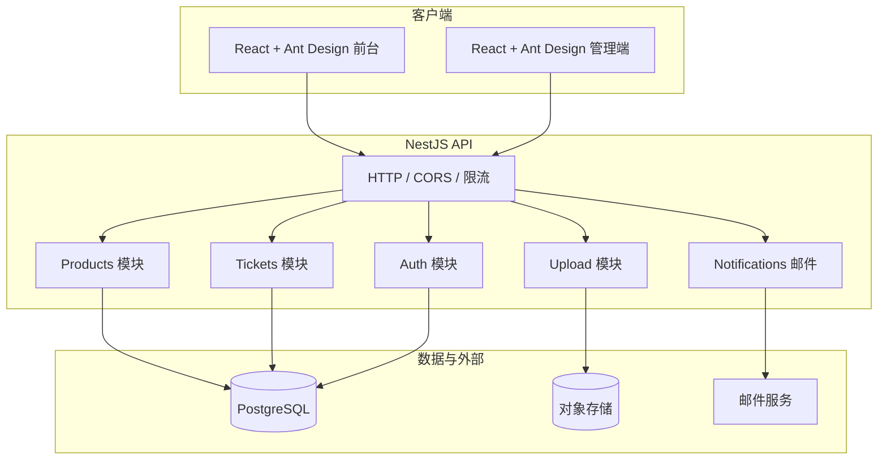
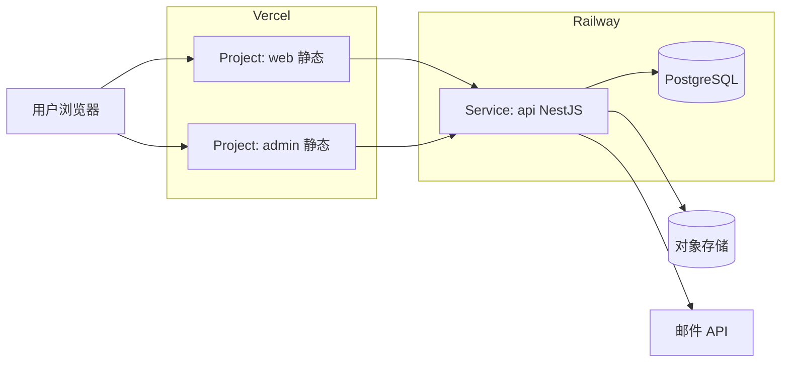

# 技术架构文档：React + Ant Design + NestJS

> 面向宠物用品售后服务网站 MVP（商品展示、售后工单、中英双语）。与 `docs/requirements/mvp-prd.md`、`docs/architecture/project-structure.md` 对齐。

## 1. 文档目的与读者

| 读者 | 用途 |
|------|------|
| 全栈 / 前端 / 后端 | 统一技术选型、模块边界、接口约定 |
| 运维 / DevOps | 部署拓扑、环境变量、健康检查 |
| 后续协作 | 扩展功能时的约束与演进方向 |

---

## 2. 技术栈总览

| 层级 | 技术 | 说明 |
|------|------|------|
| 前台 Web | React 18+、TypeScript、Vite | SPA 或 SSR 按需选型（MVP 推荐 SPA + 静态托管） |
| UI | Ant Design 5.x、`@ant-design/icons` | 表单、表格、布局、国际化与 a11y 基础能力 |
| 路由 | React Router 6 | 前台 `/`、后台 `/admin/*` 分域路由 |
| 国际化 | `react-i18next` 或 Ant Design `ConfigProvider` + `locale` | `en-US` / `zh-CN`，与 `packages/i18n` 文案键对齐 |
| 后台管理 Web | 同上（独立应用或同仓多入口） | 与前台共享 `packages/ui`、`packages/types` |
| 服务端 | Node.js LTS、NestJS 10+ | 模块化、依赖注入、与 OpenAPI 天然契合 |
| API 风格 | REST + JSON | 版本前缀建议 `/api/v1` |
| 校验 | `class-validator` + `class-transformer` | DTO 与 OpenAPI 文档一致 |
| 持久化 | PostgreSQL（推荐）或 SQLite（仅本地/MVP 极简） | 工单、商品、附件元数据 |
| 对象存储 | S3 兼容（如 R2、MinIO、AWS S3） | 售后图片凭证 |
| 邮件 | SMTP 或 SendGrid / Resend 等 HTTP API | 提交确认、状态变更通知 |
| 鉴权（后台） | JWT（Access + 可选 Refresh）或 Session + HttpOnly Cookie | 仅 `admin` 需登录；前台工单查询用「工单号+邮箱」业务校验 |
| 托管（推荐） | **Vercel + Railway** | 前台/管理端部署到 Vercel；NestJS API 与 PostgreSQL 部署到 Railway（见第 4.1、4.2 节） |

---

## 3. 系统上下文与逻辑架构



### 3.1 边界说明

- **前台**：无登录；提交工单、上传图片、按工单号+邮箱查询；只读商品。
- **管理端**：登录后操作工单状态、内部备注、对外回复；只读/维护商品（MVP 可先种子数据或简单 CRUD）。
- **API**：单一 Nest 应用部署；通过环境区分 `NODE_ENV`；生产启用 HTTPS、CORS 白名单。生产环境由 Vercel 提供 HTTPS 与边缘路由（见第 4.1 节）。

---

## 4. 仓库与部署形态（与 monorepo 对齐）

推荐与现有规划一致：

```text
apps/
  web/          # 顾客站（Vite + React + antd）
  admin/        # 客服后台（Vite + React + antd）
  api/          # NestJS
packages/
  types/        # DTO、枚举、API 路径常量（可与 OpenAPI 生成互相同步）
  i18n/         # 前后台共用文案键（可选）
  ui/           # 跨应用小组件（若 antd 已覆盖则可变薄）
```

**部署总述（MVP 推荐：Vercel + Railway）**

- **`apps/web`、`apps/admin`**：构建为静态资源，部署到 **Vercel**（每个应用一个 Project，或 Monorepo 下通过 Root Directory 分别指向子目录）。
- **`apps/api`（NestJS）**：部署到 **Railway Web Service**（常驻进程，避免 Serverless 冷启动/时长约束）。
- **数据库 / 对象存储 / 邮件**：优先使用 Railway PostgreSQL + 外部对象存储/邮件服务（如 S3 兼容存储、Resend），由 API 通过环境变量连接。

### 4.1 部署架构（前端：Vercel）

#### 拓扑示意



#### 前台与管理端（Vite + React + Ant Design）

| 项 | 建议 |
|----|------|
| 构建命令 | 各应用目录内 `npm run build`（输出一般为 `dist/`） |
| Output | **Static**；`vercel.json` 中配置 SPA 回退：`routes` 或 `rewrites` 将非文件请求指向 `index.html` |
| 环境变量 | `VITE_API_BASE_URL`（或等价前缀）指向生产 API 的绝对 URL（如 `https://xxx.up.railway.app/api/v1`） |
| 多环境 | Production / Preview：在 Vercel 项目 **Environment Variables** 中分别为 Production、Preview、Development 配置不同 `VITE_API_BASE_URL` |
| 自定义域名 | 在各自 Project 的 **Domains** 中绑定（如 `www.example.com` 与 `admin.example.com`） |

### 4.2 部署架构（服务端：Railway）

Railway 以容器化常驻服务运行 NestJS，更适合当前 API 形态（`nest start` / `node dist/main`）与 Prisma 迁移流程：

| 项 | 说明 |
|----|------|
| Service Root Directory | `apps/api` |
| Build Command | `npm ci && npm run build && npx prisma generate` |
| Start Command | `npm run start:prod` |
| 路由前缀 | Nest 保持 `API_PREFIX=/api/v1`，前端统一访问 `${VITE_API_BASE_URL}/tickets` 等路径 |
| 数据库 | 同一 Railway Project 下添加 PostgreSQL，向 API 注入 `DATABASE_URL` |
| 迁移策略 | 生产环境仅使用 `npx prisma migrate deploy`；不在生产执行 `migrate dev` |
| 运行特征 | 常驻进程，适合当前 Nest 模块化 API 与后续队列/长任务扩展 |

#### 环境变量与安全（Railway API）

- 在 **API Service** 中配置：`DATABASE_URL`、对象存储密钥、邮件 API Key、`JWT_SECRET`、`API_PREFIX`、`CORS_ORIGINS` 等；**勿**提交到仓库。
- **CORS**：`CORS_ORIGINS` 填写 `web`、`admin` 的 Vercel 生产域（以及需要的 Preview 域）。
- **端口**：Railway 自动注入 `PORT`，Nest 读取 `process.env.PORT` 启动。

#### Monorepo 在 Vercel + Railway 的配置要点

- 在 Vercel 为 **web / admin** 各建一个 Project，**Root Directory** 分别设为 `apps/web`、`apps/admin`。
- 在 Railway 为 **api** 建一个 Service，Root Directory 设为 `apps/api`，并添加 PostgreSQL。
- **Install Command** 若在根目录安装依赖：`cd ../.. && npm ci`（按实际包管理器调整），或使用 Turborepo / pnpm workspace 的 `filter` 仅安装所需子图。
- **Ignored Build Step**：可选，用于仅当对应路径变更时才构建（节省额度）。

#### Railway 数据库迁移（Prisma）

1. 本地开发修改 schema 后，提交 `apps/api/prisma/migrations/*` 到仓库。
2. Railway 部署时（具备生产 `DATABASE_URL` 的环境）执行：`npx prisma migrate deploy`。
3. 推荐将迁移加入 Railway Release/Post-deploy 环节，确保每次发布自动应用未执行迁移。
4. 禁止在生产环境执行 `npx prisma migrate dev`。

#### 备选（API 放在 Vercel Serverless 时）

若后续需要统一平台，可将 API 迁移到 Vercel Serverless；但需额外处理函数时长、冷启动、长连接与队列策略。当前 MVP 默认采用 Railway 作为服务端部署目标。

---

## 5. 前端架构（React + Ant Design）

### 5.1 应用分层

| 层 | 职责 | 示例 |
|----|------|------|
| `pages/` | 路由级页面，组合布局与业务块 | `HomePage`, `SupportRequestPage` |
| `features/` | 按领域拆分的容器与逻辑 | `tickets/`, `products/` |
| `components/` | 通用展示组件 | 封装 antd 的 `PageHeader`、`ResultLayout` |
| `api/` | Axios/fetch 封装、拦截器、错误映射 | `client.ts`, `ticketsApi.ts` |
| `hooks/` | 数据请求、表单、媒体查询 | `useTicketQuery` |
| `routes/` | 路由表与懒加载 | `createBrowserRouter` |
| `i18n/` | 资源加载与语言切换 | 与 `packages/i18n` 同步 |

### 5.2 与 Ant Design 的约定

- 使用 `ConfigProvider` 统一主题（主色、圆角、字体），便于品牌一致。
- 表单：`Form` + `rules` 与后端 DTO 校验错误码对齐（见第 7 节）。
- 表格：管理端工单列表用 `Table` + 服务端分页/排序/筛选参数。
- 上传：`Upload` 与后端预签名 URL 或直传策略一致；限制 `accept`、数量、大小与 PRD 一致。

### 5.3 状态与数据获取

- **MVP**：以 **React Query (TanStack Query)** 或 **SWR** 管理服务端状态；本地 UI 状态用 `useState`/`useReducer`。
- 避免在 MVP 阶段引入过重全局状态库，除非多页面强共享。

### 5.4 安全与体验（前台）

- 不在前端存放密钥；上传走短期凭证或后端代理。
- 工单查询：防止枚举与信息泄露——错误提示统一为「无法找到匹配的工单，请核对工单号与邮箱」（与 PRD 一致）。

---

## 6. 后端架构（NestJS）

### 6.1 模块划分（建议）

| 模块 | 职责 |
|------|------|
| `AppModule` | 全局中间件、配置、健康检查 |
| `ConfigModule` | `@nestjs/config` 加载 `.env`，校验必填项 |
| `DatabaseModule` | TypeORM / Prisma / Drizzle 任选其一，统一迁移策略 |
| `ProductsModule` | 商品只读 API（列表、详情、搜索） |
| `TicketsModule` | 工单创建、查询（工单号+邮箱）、状态流转（内部） |
| `AttachmentsModule` | 上传凭证：签发上传 URL 或接收 multipart 后转存 OSS |
| `NotificationsModule` | 异步发送邮件（队列可选：BullMQ + Redis） |
| `AuthModule` | 管理端登录、JWT 守卫、`RolesGuard` |
| `HealthModule` | `/health` 供编排探活 |

### 6.2 分层约定

- **Controller**：HTTP 映射、DTO 绑定、状态码；不写业务规则。
- **Service**：领域逻辑、事务边界。
- **Repository / ORM**：持久化；复杂查询可下沉 Query 对象。
- **DTO**：`class-validator` 装饰器与 Swagger 元数据一致。

### 6.3 API 设计要点

- 统一前缀：`/api/v1`。
- 统一错误体：`{ code: string, message: string, details?: unknown }`，HTTP 状态码语义正确（400 校验、401/403 鉴权、404 资源、409 冲突等）。
- 使用 `@nestjs/swagger` 生成 OpenAPI，与 `packages/types` 或前端 Orval/ openapi-typescript 同步（可选自动化）。

### 6.4 工单与商品核心模型（逻辑）

- **Product**：id、多语言字段（name/description 等）、分类、图片 URL、规格 JSON。
- **Ticket**：ticketNo（对外展示）、email（哈希或规范化存储视安全策略）、状态枚举、问题类型、描述、时间戳。
- **TicketAttachment**：ticketId、storageKey、mime、size。
- **TicketReply**：区分 internal / public，供查询页展示最新对外回复。

（具体表结构在实现阶段落到 migration 与 `docs/api/`。）

---

## 7. 前后端协作契约

1. **单一事实来源**：接口字段名、枚举值以 OpenAPI 或 `packages/types` 为准。
2. **分页**：`page`、`pageSize`、`total`；或 cursor 分页（若列表很大再演进）。
3. **上传**：先 `POST /uploads/presign` 再直传 OSS，或 `POST /tickets/:id/attachments` multipart（MVP 可二选一）。
4. **i18n**：后端校验错误码稳定，前端用错误码映射中英文文案。

---

## 8. 安全架构（MVP 必做项）

| 项 | 做法 |
|----|------|
| 传输 | 全站 HTTPS |
| CORS | 仅允许前台/管理端来源 |
| 鉴权 | 管理端 JWT + 短期过期；刷新策略按团队习惯 |
| 工单查询 | 校验邮箱+工单号匹配；限流防爆破 |
| 上传 | 类型与大小限制；病毒扫描可后置 |
| 日志 | 不落库用户敏感原文到非必要日志；PII 脱敏 |
| 依赖 | `npm audit` / Dependabot；Nest 与 Node LTS 跟进 |

---

## 9. 可观测性与运维

- **日志**：结构化 JSON（pino / nest-logger），请求 id 贯通。
- **指标**：HTTP 延迟、5xx 率、队列深度（若用队列）。
- **探活**：`GET /health`（DB 可选探测）。
- **配置**：12-factor，密钥不进镜像；用环境变量或密钥管理服务。

---

## 10. 测试策略

| 类型 | 范围 |
|------|------|
| 单元测试 | Nest Service 纯逻辑；前端工具函数 |
| API 集成测试 | Supertest + 测试数据库 |
| E2E | Playwright：`提交工单 → 后台改状态 → 前台查询`（`tests/e2e`） |

---

## 11. 演进路线（非 MVP）

- 实时通知（WebSocket / SSE）。
- 工单评论线程、附件多版本。
- 多客服角色与审计日志强化。
- 国际化扩展更多语言；CMS 管理商品文案。
- 从 SPA 迁到 Next.js 仅在有 SEO/SSR 强需求时评估。

---

## 12. 相关文档

- 需求：`docs/requirements/mvp-prd.md`
- 开发计划：`docs/planning/mvp-development-plan.md`
- 仓库结构：`docs/architecture/project-structure.md`
- 发布与环境治理（预发 / 线上，含端到端操作手册第 13 节）：`docs/maintenance/release-environment-governance.md`
- 原型：`docs/prototype/`
- API 细则：后续补充 `docs/api/`（OpenAPI 或端点说明）

---

## 13. 修订记录

| 版本 | 日期 | 说明 |
|------|------|------|
| 1.0 | 2026-04-09 | 初版：React + antd + NestJS 全栈架构 |
| 1.1 | 2026-04-09 | 增加 Vercel 部署拓扑、web/admin/api 配置要点与 Nest Serverless 约束 |
| 1.2 | 2026-04-09 | 相关文档增加开发计划链接 |
| 1.3 | 2026-04-10 | 部署方案更新为「前端 Vercel + 服务端 Railway」，补充 Railway 环境变量与 Prisma 迁移流程 |
| 1.4 | 2026-04-10 | 相关文档增加《发布与环境治理规范》链接 |
| 1.5 | 2026-04-10 | 相关文档注明发布规范含端到端操作手册（第 13 节） |
