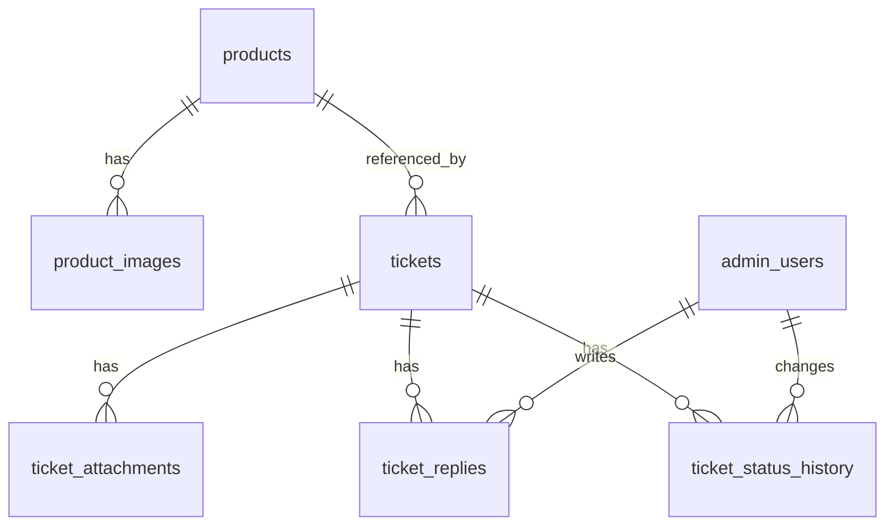

# 宠物用品售后服务网站 MVP 数据库设计与表关系

> 本文档面向 MVP 阶段，覆盖“商品展示 + 售后工单处理 + 后台客服操作”核心数据模型。与 `docs/requirements/mvp-prd.md`、`docs/architecture/tech-architecture-react-antd-nestjs.md` 对齐。

## 1. 设计目标

- 支撑前台能力：商品展示、售后申请提交、工单查询
- 支撑后台能力：工单分拣、状态流转、对外回复、内部备注
- 数据可追溯：保留状态变更历史，便于问题排查与运营统计
- 可扩展：为后续邮件事件、标签、SLA、统计报表预留结构空间

## 2. 设计范围（MVP）

MVP 必备实体（7 张表）：

1. `products`（商品主表）
2. `product_images`（商品图片）
3. `tickets`（工单主表）
4. `ticket_attachments`（工单附件）
5. `ticket_replies`（工单回复）
6. `admin_users`（后台用户）
7. `ticket_status_history`（工单状态流转历史）

## 3. ER 关系总览

关系说明：

- 一个商品可以有多张图片
- 一个商品可被多个工单引用（按 `product_id`）
- 一个工单可有多条附件、回复、状态变更记录
- 一个后台用户可创建多条回复与状态变更操作

## 4. 表结构设计

以下字段类型以 PostgreSQL 为参考。

### 4.1 `products`（商品主表）

用途：前台商品列表与详情展示的数据源。

| 字段 | 类型 | 约束 | 说明 |
|---|---|---|---|
| `id` | `uuid` | PK | 主键 |
| `sku` | `varchar(64)` | UNIQUE, NOT NULL | 商品唯一编码 |
| `name_en` | `varchar(255)` | NOT NULL | 英文商品名 |
| `name_zh` | `varchar(255)` | NOT NULL | 中文商品名 |
| `category` | `varchar(100)` | NOT NULL | 分类 |
| `description_en` | `text` | NULL | 英文描述 |
| `description_zh` | `text` | NULL | 中文描述 |
| `specs_json` | `jsonb` | NULL | 规格参数 |
| `policy_summary_en` | `text` | NULL | 英文售后政策摘要 |
| `policy_summary_zh` | `text` | NULL | 中文售后政策摘要 |
| `is_active` | `boolean` | NOT NULL, DEFAULT true | 是否可展示 |
| `created_at` | `timestamptz` | NOT NULL | 创建时间 |
| `updated_at` | `timestamptz` | NOT NULL | 更新时间 |

建议索引：

- `idx_products_category`(`category`)
- `idx_products_is_active`(`is_active`)
- 如需关键词搜索，可加 `GIN` 全文索引（后续迭代）

---

### 4.2 `product_images`（商品图片）

用途：商品多图管理（详情页主图/缩略图）。

| 字段 | 类型 | 约束 | 说明 |
|---|---|---|---|
| `id` | `uuid` | PK | 主键 |
| `product_id` | `uuid` | FK -> `products.id`, NOT NULL | 所属商品 |
| `image_url` | `text` | NOT NULL | 图片 URL |
| `sort_order` | `int` | NOT NULL, DEFAULT 0 | 排序 |
| `created_at` | `timestamptz` | NOT NULL | 创建时间 |

建议约束与索引：

- 外键删除策略：`ON DELETE CASCADE`
- `idx_product_images_product`(`product_id`)

---

### 4.3 `tickets`（工单主表）

用途：售后流程核心实体，承载查询与处理状态。

| 字段 | 类型 | 约束 | 说明 |
|---|---|---|---|
| `id` | `uuid` | PK | 主键 |
| `ticket_no` | `varchar(32)` | UNIQUE, NOT NULL | 对外工单号（如 `T20260409XXXX`） |
| `status` | `varchar(32)` | NOT NULL | 工单状态（见状态约束） |
| `issue_type` | `varchar(50)` | NOT NULL | 问题类型 |
| `issue_description` | `text` | NOT NULL | 问题描述 |
| `customer_name` | `varchar(120)` | NOT NULL | 客户姓名 |
| `customer_email` | `varchar(255)` | NOT NULL | 客户邮箱（查询凭证之一） |
| `customer_phone` | `varchar(50)` | NULL | 客户手机号 |
| `order_ref_no` | `varchar(100)` | NULL | 订单参考号 |
| `product_id` | `uuid` | FK -> `products.id`, NULL | 关联商品（可为空） |
| `product_name_snapshot` | `varchar(255)` | NOT NULL | 提交时商品名快照（用户输入或系统回填） |
| `latest_public_reply` | `text` | NULL | 前台查询页展示的最新对外回复摘要 |
| `last_replied_at` | `timestamptz` | NULL | 最近回复时间 |
| `created_at` | `timestamptz` | NOT NULL | 创建时间 |
| `updated_at` | `timestamptz` | NOT NULL | 更新时间 |

状态约束（MVP）：

- `submitted`
- `accepted`
- `in_progress`
- `resolved`
- `closed`

建议约束：

- `CHECK (status IN ('submitted','accepted','in_progress','resolved','closed'))`
- `CHECK (customer_email <> '')`
- `CHECK (product_name_snapshot <> '')`

建议索引：

- `idx_tickets_ticket_no`(`ticket_no`) UNIQUE
- `idx_tickets_email_ticket_no`(`customer_email`, `ticket_no`)（用于前台查询）
- `idx_tickets_status_updated_at`(`status`, `updated_at` DESC)（后台列表）
- `idx_tickets_created_at`(`created_at` DESC)

---

### 4.4 `ticket_attachments`（工单附件）

用途：保存工单上传凭证的元信息（文件本体在对象存储）。

| 字段 | 类型 | 约束 | 说明 |
|---|---|---|---|
| `id` | `uuid` | PK | 主键 |
| `ticket_id` | `uuid` | FK -> `tickets.id`, NOT NULL | 所属工单 |
| `storage_key` | `text` | NOT NULL | 对象存储 key |
| `file_name` | `varchar(255)` | NOT NULL | 原始文件名 |
| `mime_type` | `varchar(100)` | NOT NULL | 文件类型 |
| `size_bytes` | `bigint` | NOT NULL | 文件大小 |
| `created_at` | `timestamptz` | NOT NULL | 创建时间 |

建议约束与索引：

- 外键删除策略：`ON DELETE CASCADE`
- `CHECK (size_bytes > 0)`
- `idx_ticket_attachments_ticket`(`ticket_id`)

---

### 4.5 `ticket_replies`（工单回复）

用途：保存客服回复记录，支持对内备注与对外回复区分。

| 字段 | 类型 | 约束 | 说明 |
|---|---|---|---|
| `id` | `uuid` | PK | 主键 |
| `ticket_id` | `uuid` | FK -> `tickets.id`, NOT NULL | 所属工单 |
| `author_admin_id` | `uuid` | FK -> `admin_users.id`, NOT NULL | 回复人 |
| `is_public` | `boolean` | NOT NULL, DEFAULT false | 是否对客户可见 |
| `content` | `text` | NOT NULL | 回复正文 |
| `created_at` | `timestamptz` | NOT NULL | 创建时间 |

建议索引：

- `idx_ticket_replies_ticket_created`(`ticket_id`, `created_at` DESC)
- `idx_ticket_replies_public`(`ticket_id`, `is_public`, `created_at` DESC)

---

### 4.6 `admin_users`（后台用户）

用途：后台登录与操作归属。

| 字段 | 类型 | 约束 | 说明 |
|---|---|---|---|
| `id` | `uuid` | PK | 主键 |
| `email` | `varchar(255)` | UNIQUE, NOT NULL | 登录账号 |
| `password_hash` | `text` | NOT NULL | 密码哈希 |
| `role` | `varchar(50)` | NOT NULL | 角色（`agent` / `admin`） |
| `is_active` | `boolean` | NOT NULL, DEFAULT true | 是否启用 |
| `last_login_at` | `timestamptz` | NULL | 最近登录时间 |
| `created_at` | `timestamptz` | NOT NULL | 创建时间 |
| `updated_at` | `timestamptz` | NOT NULL | 更新时间 |

建议约束：

- `CHECK (role IN ('agent','admin'))`

---

### 4.7 `ticket_status_history`（状态流转历史）

用途：记录工单状态每次变化，实现可追溯审计。

| 字段 | 类型 | 约束 | 说明 |
|---|---|---|---|
| `id` | `uuid` | PK | 主键 |
| `ticket_id` | `uuid` | FK -> `tickets.id`, NOT NULL | 所属工单 |
| `from_status` | `varchar(32)` | NULL | 变更前状态（首次可为空） |
| `to_status` | `varchar(32)` | NOT NULL | 变更后状态 |
| `changed_by_admin_id` | `uuid` | FK -> `admin_users.id`, NULL | 操作者（系统任务可为空） |
| `comment` | `text` | NULL | 变更备注 |
| `created_at` | `timestamptz` | NOT NULL | 变更时间 |

建议索引：

- `idx_ticket_status_history_ticket_created`(`ticket_id`, `created_at` DESC)

## 5. 关键业务规则与数据约束

### 5.1 前台查询规则

- 查询条件为 `ticket_no + customer_email`
- 返回信息只包含该工单公开信息，避免数据泄露
- 错误提示统一，不暴露“工单不存在”或“邮箱错误”的细节差异
- 建议限流：同一 IP / 同一邮箱组合在固定时间窗口内限制查询次数（阈值由配置定义）

### 5.2 状态流转规则（建议）

- `submitted -> accepted -> in_progress -> resolved -> closed`
- 允许在 `accepted` 或 `in_progress` 阶段直接 `closed`（业务取消场景）
- 每次状态变更必须插入 `ticket_status_history`

### 5.3 附件规则

- 单工单最多 3 个附件（在应用层校验）
- 限制 `mime_type`：`image/jpeg`, `image/png`, `image/webp`
- 文件大小默认上限 5MB/张（可配置，建议应用层 + 网关双重限制）

## 6. 性能与索引策略（MVP）

后台列表最常见条件：状态筛选 + 时间排序，建议复合索引：

- `tickets(status, updated_at DESC)`

前台查询最常见条件：工单号 + 邮箱，建议：

- `tickets(ticket_no)` 唯一索引
- `tickets(customer_email, ticket_no)` 复合索引

回复与历史查询按时间倒序，建议：

- `ticket_replies(ticket_id, created_at DESC)`
- `ticket_status_history(ticket_id, created_at DESC)`

## 7. 安全与合规建议

- 后台密码仅存 `password_hash`（如 Argon2 / bcrypt），禁止明文
- 日志避免输出完整邮箱与敏感文本，可做脱敏
- 附件仅保存对象存储 `storage_key`，通过受控链接访问
- 生产库开启自动备份与最小权限账号策略

## 8. 迁移与初始化建议

### 8.1 执行顺序

1. 创建基础表：`admin_users`、`products`
2. 创建从属表：`product_images`、`tickets`
3. 创建工单子表：`ticket_attachments`、`ticket_replies`、`ticket_status_history`
4. 初始化字典与种子数据（可选）
5. 添加索引并验证查询计划

### 8.2 与代码层对齐建议

- 在 `packages/types` 维护状态枚举与接口契约
- NestJS DTO 校验规则与表约束保持一致（避免双标）
- 更新 API 文档时同步更新本文档，保持“单一事实来源”

## 9. 非 MVP 扩展（后续）

- `email_events`：邮件发送与重试日志
- `ticket_tags` / `tags`：工单标签体系
- `sla_policies` / `sla_records`：SLA 时效管理
- `audit_logs`：统一操作审计
- `kb_articles`：售后知识库内容管理

## 10. 修订记录

| 版本 | 日期 | 说明 |
|---|---|---|
| 1.0 | 2026-04-09 | 初版：MVP 表设计、ER 关系、约束与索引建议 |

